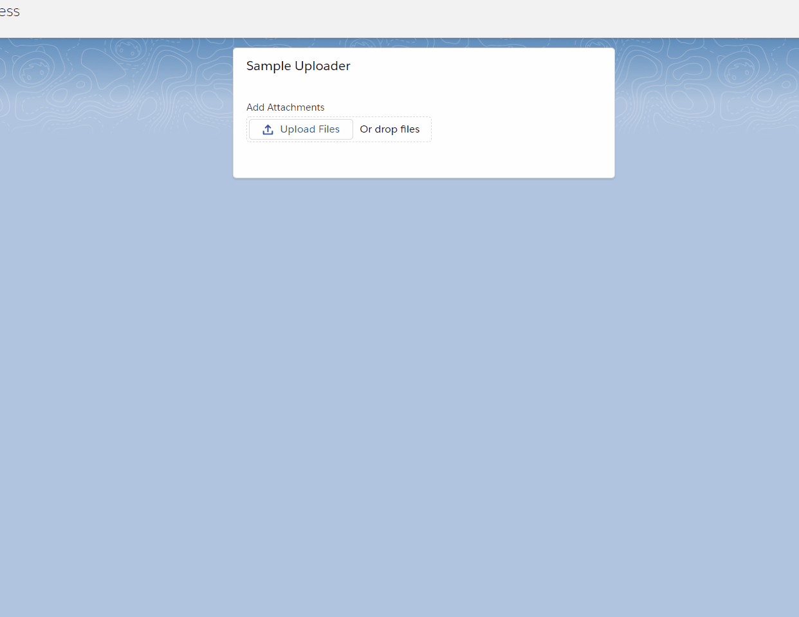

# aura-file-uploader

This is a file upload wrapper of the `lighting:fileUpload` base component from Salesforce.

Files are uploaded to the required `recordId` attribute. The `lightning:fileUpload` event `onuploadfinished` is bubbled up with a component event `fileUploader` of type `c:E_Message`. Removing files from the list will refire the event after the files are deleted.

## Usage

```html
<!-- recordId is required -->
<aura:component description="TestComponent"
	access="global"
	implements="flexipage:availableForAllPageTypes" >

	<aura:handler name="fileUploader" event="c:E_Message" action="{!c.onFileUpload}" />

	<div class="slds-grid slds-grid_align-center">
		<div class="slds-col slds-size_1-of-3">
			<lightning:card title="Sample Uploader">
				<div class="slds-p-around_medium">

					<c:FileUploader recordId="0051I000000pmJTQAY" />

				</div>
			</lightning:card>
		</div>
	</div>

</aura:component>
```

## Demo

